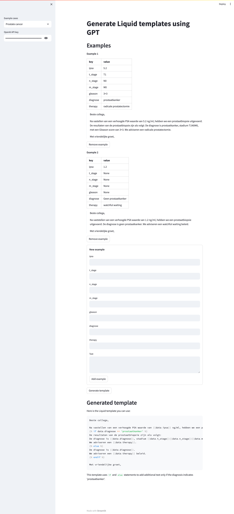

# GPT-based Liquid-template generator for automatic medical letter generation

## Getting Started

### Prerequisites

- python 3.11
- poetry

### Installing

```bash
poetry install
```

### Running

Activate the virtual environment

```bash
poetry shell
```

Run the Streamlit app

```bash
streamlit run app.py
```

## Example


